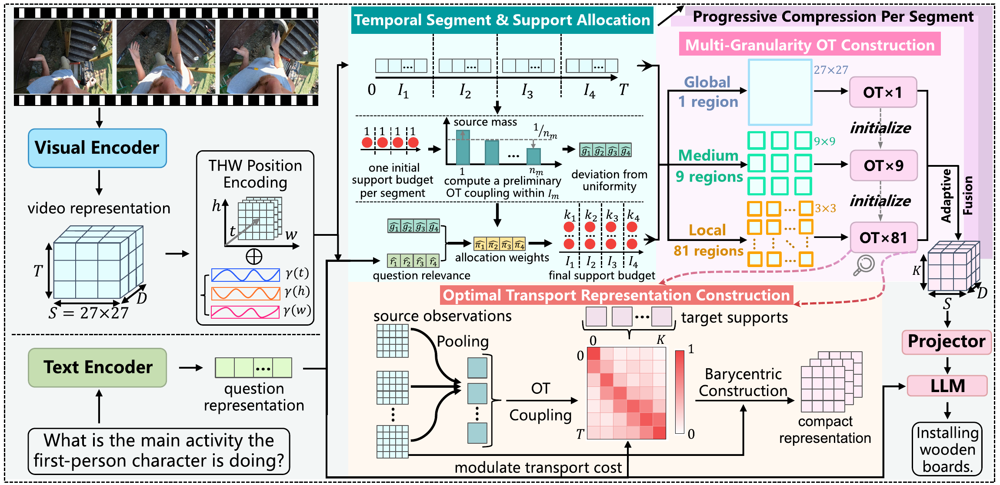

<div align="center">

<h2 align="center">
Aggregating Visual Information with Optimal Transport for VideoLM Token Compression
</h2>

[](https://arxiv.org/abs/2608.20473)

</div>

## 📖 Abstract

Video language models process videos as dense visual-token sequences with substantial representational redundancy.
Compressing these sequences is therefore essential for reducing the visual-token burden
on language-model decoding. The central challenge is to preserve visual information dispersed across frames under
such compression. To this end, we introduce Aggregating Visual Information
with Optimal Transport (AVIOT), which casts video token
compression as transporting a dense empirical measure of frame observations
onto a compact target measure. The resulting source-to-target coupling
induces a distribution over source observations for each target support, directly specifying how
the compressed video representation is constructed.
We further adapt this construction along task and spatial axes. Question conditioning
modulates the transport cost between source frames and target supports, while
influencing how many supports are allocated to each temporal segment, thereby
directing representation capacity toward question-relevant content.
At multiple spatial granularities, AVIOT computes region-specific temporal transport plans and
adaptively fuses the representations they yield, allowing different regions within the same compact representation to draw from different moments.
Evaluations across varying compression ratios show that AVIOT
matches or outperforms the uncompressed baseline on multiple video-understanding
benchmarks while retaining strong performance at higher compression ratios.

<div align="center">
  
</div>

## 🎬 Demo

See how AVIOT compresses 224 sampled observations from an eight-minute video into 28 compact,
question-aware supports, constructs evidence through multi-scale optimal transport, and decodes
the final answer.

https://github.com/user-attachments/assets/e004aaf0-c72d-4c1b-be35-529d21cc362a

## 📌 TODO

- [x] Release the AVIOT paper.
- [ ] Release the AVIOT model weights.

## 🛠️ Environment

The released configuration uses Python 3.10 or newer, CUDA-enabled PyTorch, Transformers 4.56
or newer, BF16, FlashAttention 2, and DeepSpeed ZeRO-1 for distributed training. Install the
package and its runtime dependencies from the repository root:

```bash
python -m venv .venv
source .venv/bin/activate
python -m pip install --upgrade pip
python -m pip install -e .
```

Install the optional training and attention dependencies when training with the distributed
configuration:

```bash
python -m pip install -e '.[train,flash]'
```

## 📦 Checkpoints

AVIOT is distributed as one self-contained model directory. The decoder, visual encoder,
compressor, tokenizer, and their configurations are loaded together from the checkpoint path:

```text
checkpoints/aviot/
  config.json
  model.safetensors.index.json
  model-*.safetensors
  tokenizer.json
  tokenizer_config.json
  vision_tower/
    config.json
    preprocessor_config.json
```

No additional visual checkpoint or preparation step is required.

## 📂 Data Preparation

Training records use JSON, JSONL, or a YAML manifest. Each conversation record contains one
video path and alternating user and assistant turns:

```json
{
  "id": "sample-id",
  "video": "relative/path.mp4",
  "conversations": [
    {"from": "human", "value": "What is happening?"},
    {"from": "gpt", "value": "A person demonstrates an activity."}
  ]
}
```

Relative video paths are resolved against `data.video_root`. The default sampling path uses 2 FPS,
caps each video at 224 frames, and preserves the physical frame timestamps used by the model.

## 🚀 Training

Edit `configs/train.yaml` to point to the local model checkpoint, annotations, and video root. Launch
one process per GPU with:

```bash
torchrun --nproc_per_node=8 -m aviot.training.train \
  --config configs/train.yaml
```

Resume the latest Trainer checkpoint in the configured output directory:

```bash
torchrun --nproc_per_node=8 -m aviot.training.train \
  --config configs/train.yaml \
  --resume-from-checkpoint
```

An explicit checkpoint directory can be passed after `--resume-from-checkpoint`. The restored
optimizer step synchronizes the progressive compressor schedule and allocation temperature with
the Trainer state.

## 🔎 Inference

AVIOT accepts a video, a natural-language question, and an inference-time compression ratio.
The default decoding path is deterministic (`temperature=0`):

```bash
aviot-infer \
  --checkpoint /path/to/aviot-checkpoint \
  --video /path/to/video.mp4 \
  --question 'What happens after the person opens the door?' \
  --ratio 4
```

The model first encodes the sampled source frames, compresses the temporal axis to
`ceil(num_frames / ratio)` supports, applies the spatial-granularity transport and fusion path,
and projects each compact support into the language model visual prefix. The target cardinality
can be changed directly at inference time without changing the command structure.

## 🧪 Evaluation

The generic evaluator reads records with `video`, `question`, and optional `answer` fields. A
minimal evaluation record is:

```json
{
  "id": "example-1",
  "video": "sample.mp4",
  "question": "What is happening in the video?",
  "answer": "A person demonstrates an activity."
}
```

Run exact-match or multiple-choice evaluation with:

```bash
aviot-evaluate \
  --checkpoint /path/to/aviot-checkpoint \
  --input examples/evaluation.jsonl \
  --video-root /path/to/videos \
  --output outputs/predictions.jsonl \
  --ratio 4 \
  --metric exact_match
```

Predictions are streamed to the requested JSONL file. The evaluator does not create frame caches
or duplicate video files.

## ⚙️ Configuration

The default configuration uses progressive ratios from 2 to 10 during training, four temporal
segments, global/medium/local spatial blocks of `27/9/3`, BF16, FlashAttention 2, ZeRO-1, a
learning rate of `1e-5`, cosine decay, and a 3% warmup. The target cardinality remains directly
controllable during inference, including ratios outside the training schedule.

## 📝 Citation

If you find AVIOT useful in your research, please cite our paper:

```bibtex
@misc{yin2026aggregatingvisualinformationoptimal,
      title={Aggregating Visual Information with Optimal Transport for VideoLM Token Compression},
      author={Wenti Yin and Xiaotian Han and Junyuan Shang and Yuchen Ding and Shuohuan Wang and Dianhai Yu and Changxin Gao and Nong Sang},
      year={2026},
      eprint={2608.20473},
      archivePrefix={arXiv},
      primaryClass={cs.CV},
      url={https://arxiv.org/abs/2608.20473},
}
```

## 📜 License

Code and the separately distributed AVIOT checkpoint are released under the Apache License 2.0.
Datasets are governed by their respective terms. See `NOTICE` for attribution.

## ⭐ Star

If you find this repository useful, please consider starring it.
